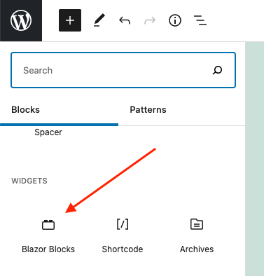
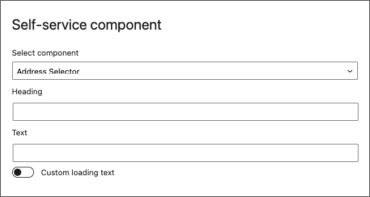

# SEAS-NVE Blazor Blocks

Gutenberg blocks written with ESNext standard and JSX support – build step required.

## Description

This is made as a Wordpress plugin and must be installed as such (see below).

These blocks are made using the official tool for making Gutenberg blocks. More about that [here](https://developer.wordpress.org/block-editor/handbook/tutorials/create-block/).

## Quick start

This section describes how to install the plugin and get it working.

(requires node version 12.0.0 or above, and npm version 6.9.0 or above)

1. Upload the plugin files to the `/web/app/plugins/seas-nve-blazor-blocks` directory, or clone the repo into the plugins directory with `git clone git@github.com:adaptdk/seas-nve-blazor-blocks.git`.

2. Activate the plugin through the 'Plugins' screen in WordPress

All the necessary javascript will be inserted on the pages automatically by magic.

## Usage

Select the block when inserting new content on a page or a post.

Select the type of component to insert and configure the other available options.

Save the page or post and you're done.

## Development

Install dependencies:

`npm install`

To start development:

`npm start`

Build the code for production:

`npm run build`

Format files:

`npm run format`

Lint CSS files:

`npm run lint:css`

Lint JavaScript files:

`npm run lint:js`

Update WordPress packages to the latest version:

`npm run packages-update`